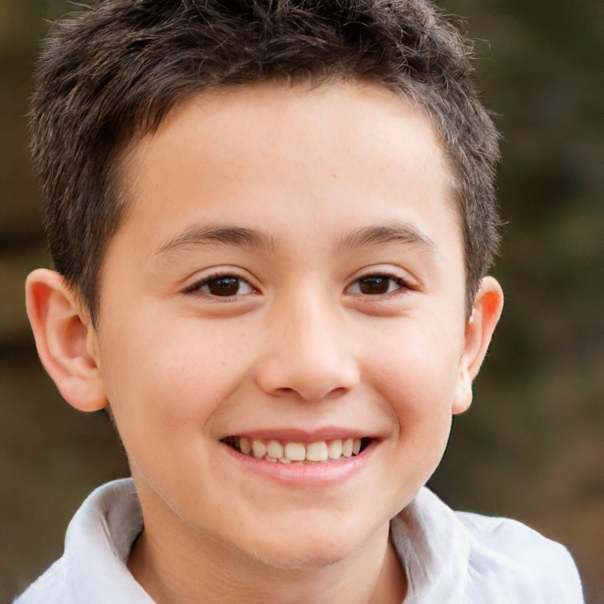
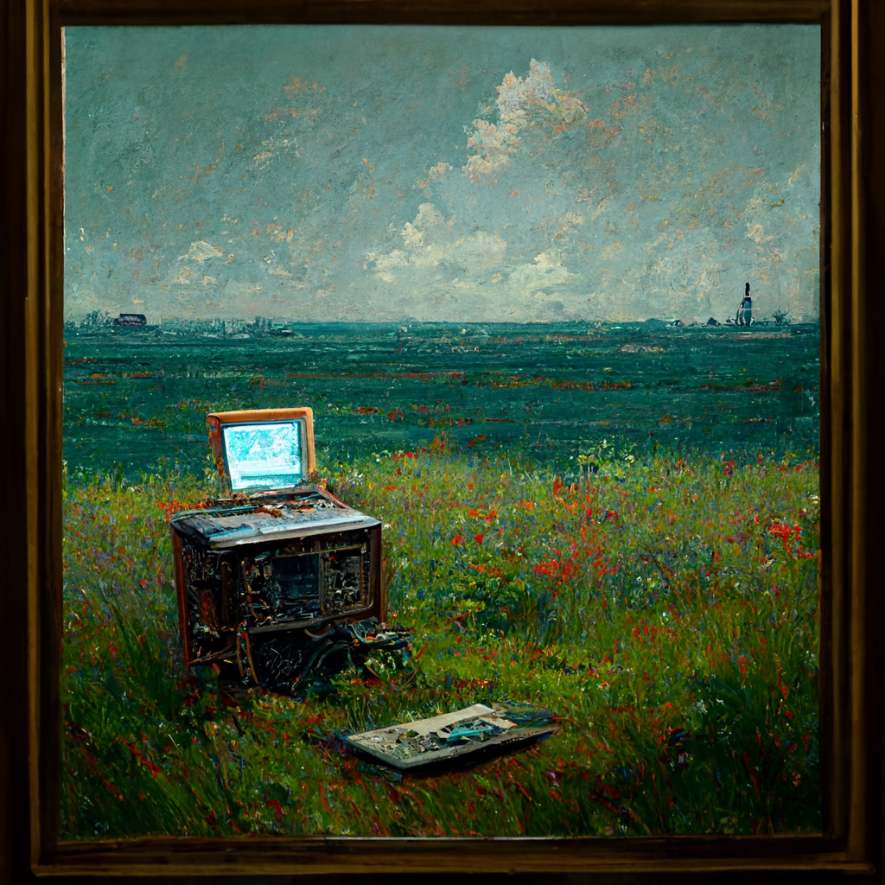
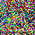
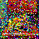
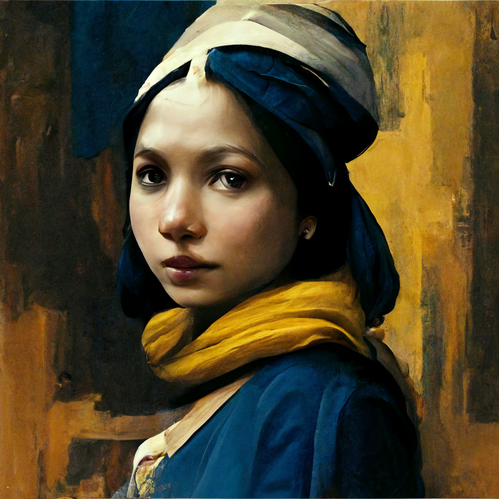

```fm
style: negative
background: true
```

## Hello _👋_

# {{process.content.frontmatter.title}}

_Cultural context and examples_

<footer>

2022 · LiipTalk · Stefan Huber · Zurich</small>

</footer>

--s--

## Last 25 years were crazy

- **New approaches** in research ([LSTM in deep learing](https://en.wikipedia.org/wiki/Long_short-term_memory))
- **Neural networks** (similar to a brains) took over
- **Ability of computers** (chips/GPU specific for AI)

<footer>

[Sepp Hochreiter; Jürgen Schmidhuber (1997). "Long short-term memory". Neural Computation.](https://www.researchgate.net/publication/13853244_Long_Short-term_Memory)

</footer>

--s--

## Image generation with AI

- **[Image style transfer](https://en.wikipedia.org/wiki/Neural_style_transfer)** · 2016
- **[Deepfake](https://en.wikipedia.org/wiki/Deepfake)** · 2017
- **[StyleGAN](https://en.wikipedia.org/wiki/StyleGAN)** · 2019
- **[Text-to-image models](https://en.wikipedia.org/wiki/Text-to-image_model)** · 2022

--s--

```fm
style: negative
background: true
```

## Image/Neural style transfer

# _Copy the style_ but not the content

--s--

## deepart.io

<div class="grid img--w100p">
<div class="col4">


<figure>

<figcaption>Image</figcaption>
</figure>

</div>
<div class="col4">


<figure>

<figcaption>Style by Benjamin Güdel</figcaption>
</figure>

</div>
<div class="col4">


<figure>

<figcaption>Result by deepart.io</figcaption>
</figure>

</div>
</div>

<footer>

Source: [deepart.io](https://en.wikipedia.org/wiki/DeepArt)

</footer>

--s--

## Style transfer vs. Illustration

<div class="grid img--w100p">
<div class="col4">


<figure>

<figcaption>Result by deepart.io</figcaption>
</figure>

</div>
<div class="col4">


<figure>

<figcaption>Illustration Benjamin Güdel</figcaption>
</figure>

</div>
</div>

--s--

```fm
style: negative
background: true
```

## Deepfake

# _Fake images_ based on originals

--s--

## Deepfake

<style>
.video-container {
  position: relative;
  padding-bottom: 56.25%;
}
.video-container iframe {
  position: absolute;
  top: 0;
  left: 0;
  width: 100%;
  height: 100%;
}
</style>

<div class="box--w80p">
<div class="video-container">
<iframe width="560" height="315" src="https://www.youtube.com/embed/9Yq67CjDqvw" title="YouTube video player" frameborder="0" allow="autoplay; clipboard-write; encrypted-media; picture-in-picture" allowfullscreen></iframe>
</div>
</div>

<footer>

Source: [«Synthesizing Obama»](https://www.youtube.com/watch?v=9Yq67CjDqvw)

</footer>

--s--

```fm
style: negative
background: true
```

## StyleGAN

# _Create portraits_ based on an analysis of portraits

--s--

## StyleGAN

<div class="grid img--w100p">
<div class="col4">


</div>
<div class="col4">


</div>
<div class="col4">



</div>
</div>

<footer>

Source: [«This Person Does Not Exist»](https://thispersondoesnotexist.com/)

</footer>

--s--

```fm
style: negative
background: true
```

## Text-to-image models

# Create images _out of text_

--s--

## Process

1. _Textual description_ of picture
2. _Picture is generated_ with the help of a neural network

> It is not a search in a set of pictures. <br>It is originally generated.

--s--

## DALL·E 2

<small>

> An old computer by Simon Stålenhag and Claude Monet, oil on canvas

</small>

<div class="grid img--w100p">
<div class="col4">


</div>
<div class="col4">


</div>
<div class="col4">


</div>
</div>

<footer>

Source: DALL·E 2 (September 2022)

</footer>

--s--

## Popular services/implementations

- [DALL·E 2](https://openai.com/dall-e-2/)
- [Stable Diffusion](https://stability.ai/blog/stable-diffusion-public-release)
- [Midjourney](https://www.midjourney.com/)
- [Google Imagen](https://imagen.research.google/)
- …

--s--

## Comparison

<small>

> An old computer by Simon Stålenhag and Claude Monet, oil on canvas

</small>

<div class="grid img--w100p">
<div class="col4">

<figure>



<figcaption>Midjourney · October 2022</figcaption>
</figure>

</div>
<div class="col4">

<figure>


<figcaption>DALL·E 2 · September 2022</figcaption>
</figure>

</div>
<div class="col4">

<figure>


<figcaption>Stable Diffusion v1.4</figcaption>
</figure>

</div>
</div>

--s--

```fm
style: negative
background: true
```

## Text-to-video models

# _Create videos_ based on text

--s--

## makeavideo.studio

<div class="box--w40p img--w100p">


</div>

<footer>

Source: Make-A-Video · Meta · [«makeavideo.studio»](https://makeavideo.studio/)

</footer>

--s--

## How it (doesn't) works in one slide

> Reduce noise in steps and amplify the text signal

<div class="grid img--w100p img--pixelate">
  <div class="col3">


  </div>
  <div class="col3">



  </div>
  <div class="col3">



  </div>
  <div class="col3">


  </div>
</div>

<footer>

Source: «A yellow frog sitting on a chair, oil on canvas» · DALL·E 2 (October 2022)

</footer>

--s--

## Image to Image

<div class="grid img--w100p img--pixelate">
  <div class="col3">


  </div>
  <div class="col3">


  </div>
  <div class="col3">


  </div>
  <div class="col3">

&nbsp;

  </div>
</div>

<footer>

Check [«How AI Image Generators Work»](https://www.youtube.com/watch?v=1CIpzeNxIhU)

</footer>

--s--

```fm
style: negative
background: true
```

## Background

# The _fourth generation_ <br>of imagery

--s--

## First Generation · _Craftsmen_


<footer>

Source: Sant’Apollinare Nuovo Ravenna, ~ 6 th century, [Wikipedia](https://en.wikipedia.org/wiki/Basilica_of_Sant%27Apollinare_Nuovo)

</footer>

--s--

## Second Generation · _Artists_

<div class="grid grid--flex">
<div class="col">


</div>
<div class="col">

<small>reference to object/subject</small>

</div>
</div>

<footer>

Source: Girl with a Pearl Earring, Jan Vermeer, 1665 [Wikipedia](https://en.wikipedia.org/wiki/Girl_with_a_Pearl_Earring)

</footer>

--s--

## Third Generation · _Photography_


<footer>

Source: Louis Jacques Mandé Daguerre, photographed by Jean-Baptiste Sabatier-Blot, 1844, [Wikipedia](https://en.wikipedia.org/wiki/Louis_Daguerre)

</footer>

--s--

## Third Generation · _Abstraction_


<footer>

Source: Black Square, Kasimir Sewerinowitsch Malewitsch, 1915, [Wikipedia](https://en.wikipedia.org/wiki/Kazimir_Malevich)

</footer>

--s--

```fm
style: negative
background: true
```

## Fourth generation · _AI_

# Artificial intelligence

--s--

```fm
style: negative
background: true
```

## In reality

# _And now what?_

- Asset creation
- Artist guidance
- …

--s--

## Integrations

- [Generate image assets in Figma](https://www.figma.com/community/plugin/1156545761250320022/Stable-Pixel-AI)
- [Microsoft integrations](https://techcrunch.com/2022/10/12/microsoft-brings-dall-e-2-to-the-masses-with-designer-and-image-creator/)
- …

--s--

## Example · _Generation_


<footer>

Source: «A computer keyboard, 6 point perspective, two colour linocut print» · DALL·E 2 (September 2022)

</footer>

--s--

## Example · _Retouch_


--s--

## Example · _Realisation_

<div class="grid img--w100p">
<div class="col8">


</div>
<div class="col4">


</div>
</div>

--s--

## Example · _Product_


--s--

## Example · _Outpainting_

<div class="grid img--w100p">
<div class="col4">

<div class="tiny">

A computer keyboard, 6 point perspective, two colour linocut print

</div>


</div>
<div class="col1">

&nbsp;

</div>
<div class="col4">

<div class="tiny">

A computer keyboard with mouse, two colour linocut print

</div>


</div>
</div>

<footer>

Source: DALL·E 2 with [outpainting](https://openai.com/blog/dall-e-introducing-outpainting/) (September 2022)

</footer>

--s--

```fm
style: negative
background: true
```

## Legal and ethics

# Let's talk about _authorship_

--s--

## Original

<small>

> Girl with a Pearl Earring by Jan Vermeer, oil on canvas

</small>

<div class="grid img--w100p">
<div class="col4">


</div>
</div>

<footer>

Source: Girl with a Pearl Earring, Jan Vermeer, 1665 [Wikipedia](https://en.wikipedia.org/wiki/Girl_with_a_Pearl_Earring)

</footer>

--s--

## Midjourney

<small>

> Girl with a Pearl Earring by Jan Vermeer, oil on canvas

</small>

<div class="grid img--w100p">
<div class="col4">



</div>
<div class="col4">


</div>
<div class="col4">


</div>
</div>

<footer>

Source: Midjourney (October 2022)

</footer>
--s--

## DALL·E 2

<small>

> Girl with a Pearl Earring by Jan Vermeer, oil on canvas

</small>

<div class="grid img--w100p">
<div class="col4">


</div>
<div class="col4">


</div>
<div class="col4">


</div>
</div>

<footer>

Source: DALL·E 2 (September 2022)

</footer>

--s--

## Stable Diffusion

<small>

> Girl with a Pearl Earring by Jan Vermeer, oil on canvas

</small>

<div class="grid img--w100p">
<div class="col4">


</div>
<div class="col4">


</div>
<div class="col4">


</div>
</div>

<footer>

Source: Stable Diffusion v1.4

</footer>

--s--

## Demo

# A _{colour}_ _{animal}_ sitting on a _{furniture}_, oil on canvas

Test with [DALL·E 2](https://labs.openai.com/)

--s--

```fm
style: negative
background: true
```

## exit 0; _🙏 thx_

# Questions?

--s--

## Links

- [arthub.ai](https://arthub.ai) & [prompthero.com](https://prompthero.com/) · prompt ideas for generating AI art
- [Stable Diffusion for MacOS](https://github.com/divamgupta/diffusionbee-stable-diffusion-ui)
- [AI-Generated Artwork Won Fine Arts Competition](https://www.vice.com/en/article/bvmvqm/an-ai-generated-artwork-won-first-place-at-a-state-fair-fine-arts-competition-and-artists-are-pissed)
- [Upscale with AI](https://replicate.com/nightmareai/real-esrgan)

<!--

Gerhard Richter → Werk ohne Autor
coding → github copilot → raphi
https://www.youtube.com/watch?v=1CIpzeNxIhU

-->
